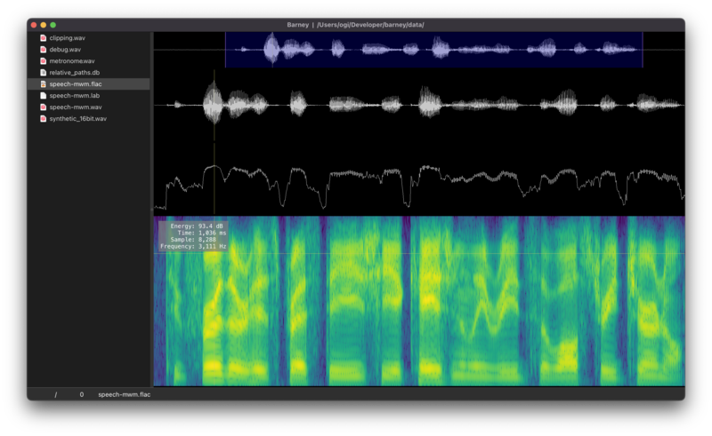

# README

## Objective

`Barney` is a tool to be used to analyze audio data, providing a high performance method of evaluating waveforms, spectrograms, and log-energy plots.



`Barney` is the open sourced version of `Fred`, a speech audio analysis tool developed within Sensory.  The open source version will in time have Sensory specific workflows be phased out, and more analysis capability added in.

### Dependencies

`Barney` It is written using Python, the Qt GUI framework and libraries common to the PyData ecosystem (`numpy` and `scipy`).  For Plotting, the `pyqtgraph` library is used very extensively.  In addition, `soundfile`, `sounddevice` libraries are used to read in audio files, and handle playback of audio from numpy arrays in a low-latency fashion.

Testing is done via `pytest` library with the `pytest-qt` plugin, documentation is generated using the `sphinx` library.

Quality checks are done with `mypy` and `flake8` linters.  `black` is used for formatting, and `pre-commit` is used to enforce their respective usage.

## Installation

From a python 3.9 virtual environment run

```bash
pip install -r requirements.txt
python -m barney
````

To run Barney, you need python 3.9 installed on your system.

## Developer documentation

First, read the [contributing guide](./CONTRIBUTING.md) which explains the basics of the development environment, the style guides and so on.

## License

MIT License

## Acknowledgements

Thank you to Sensory Inc. for open sourcing this tool to support its continued development.
